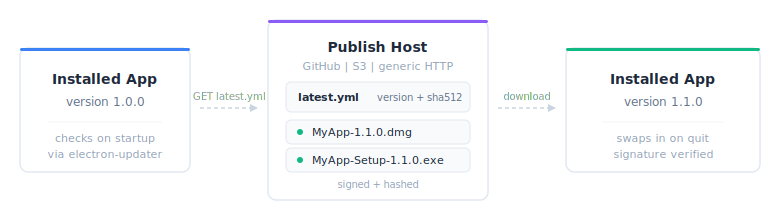

```{r}
#| include: false
library(shinyelectron)
```

Auto-updates ship by publishing a signed artifact and a matching `latest.yml` to a place the app knows to check. shinyelectron wires your project up to [electron-updater](https://www.electron.build/auto-update), which does the checking, downloading, and swap-on-quit.

{fig-alt="Three panels. A version 1.0.0 app on the left requests latest.yml from a publish host in the middle, which lists a manifest and signed installers. An arrow on the right shows the app updated to version 1.1.0."}

## Pick a publish host

Three backends are supported. Pick the one that matches how you already ship software.

| Provider | Best for | Requirements |
|----------|----------|--------------|
| GitHub Releases | Open source projects | Public or private GitHub repo |
| S3 | Enterprise deployments | AWS S3 bucket |
| Generic HTTP | Custom infrastructure | Any HTTP server |

## Quick start

Point the app at a GitHub repo and re-export. Everything else follows from configuration.

```{r}
#| eval: false
enable_auto_updates(
  "path/to/app",
  provider = "github",
  owner = "your-username",
  repo = "your-app-repo"
)
```

`enable_auto_updates()` writes the settings to `_shinyelectron.yml`. Verify them at any time with:

```{r}
#| eval: false
check_auto_update_status("path/to/app")
```

## GitHub Releases

GitHub Releases is the default, and the right choice for most open-source projects.

### Configure the app

Tell the app where to look, and choose whether it prompts the user before downloading.

```{r}
#| eval: false
enable_auto_updates(
  "path/to/app",
  provider = "github",
  owner = "myorg",
  repo = "my-shiny-dashboard",
  check_on_startup = TRUE,
  auto_download = FALSE   # Prompt user before downloading
)
```

### Build the app

Build as usual.

```{r}
#| eval: false
export("path/to/app", destdir = "build")
```

### Publish a release

1. Go to your repo on GitHub.
2. Click Releases, then Create a new release.
3. Create a tag such as `v1.0.0`.
4. Upload the built installers:
   - `MyApp-1.0.0.dmg` (macOS)
   - `MyApp-Setup-1.0.0.exe` (Windows)
   - `MyApp-1.0.0.AppImage` (Linux)
5. Publish the release.

::: {.callout-note}
File names must match `{productName}-{version}.{ext}`. electron-updater uses that pattern to find artifacts.
:::

### What the user sees

On the next launch, a version higher than the installed one triggers the update cycle:

1. The app checks on startup when `check_on_startup = TRUE`.
2. A notification tells the user an update is available.
3. The installer downloads, silently if `auto_download = TRUE`, otherwise on consent.
4. The app prompts to restart and install.

## Configuration

The full `updates` block in `_shinyelectron.yml`:

```yaml
updates:
  enabled: true
  provider: "github"
  check_on_startup: true    # Check when app starts
  auto_download: false      # Download without prompting
  auto_install: false       # Install on app quit

  github:
    owner: "your-username"
    repo: "your-repo"
    private: false          # Set true for private repos
```

### Three knobs, one pipeline

Three flags drive three stages. `check_on_startup` asks whether an update exists. `auto_download` fetches it. `auto_install` applies it on quit.

| Setting | Behavior |
|---------|----------|
| `check_on_startup: true` | Checks for updates when app launches |
| `auto_download: true` | Downloads updates silently in the background |
| `auto_install: true` | Installs the update when the user quits the app |

Sensible default: check automatically, but let the user choose when to download and restart.

```yaml
updates:
  check_on_startup: true
  auto_download: false    # Let user decide
  auto_install: false     # Let user decide when to restart
```

Security patches and regressions benefit from the aggressive posture:

```yaml
updates:
  check_on_startup: true
  auto_download: true     # Download immediately
  auto_install: true      # Install on next quit
```

## Private repositories

Private repos require a token in the user's environment.

```yaml
updates:
  github:
    owner: "my-org"
    repo: "private-app"
    private: true
```

Export `GH_TOKEN` before launch.

```bash
# macOS/Linux
export GH_TOKEN=ghp_xxxxxxxxxxxx

# Windows
set GH_TOKEN=ghp_xxxxxxxxxxxx
```

## S3

Point at a bucket for enterprise distribution.

```yaml
updates:
  enabled: true
  provider: "s3"
  s3:
    bucket: "my-app-updates"
    region: "us-east-1"
    path: "/releases"
```

The bucket should mirror the pattern GitHub Releases produces: per-platform manifests beside the installers.

```
my-app-updates/
└── releases/
    ├── latest.yml           # Update manifest
    ├── latest-mac.yml       # macOS manifest
    ├── latest-linux.yml     # Linux manifest
    ├── MyApp-1.0.0.dmg
    ├── MyApp-Setup-1.0.0.exe
    └── MyApp-1.0.0.AppImage
```

AWS credentials come from the environment.

```bash
export AWS_ACCESS_KEY_ID=xxx
export AWS_SECRET_ACCESS_KEY=xxx
```

## Generic HTTP

Anything that can serve static files works.

```yaml
updates:
  enabled: true
  provider: "generic"
  generic:
    url: "https://updates.example.com/releases"
```

Your server must deliver:

1. Update manifests (`latest.yml`, `latest-mac.yml`, `latest-linux.yml`).
2. The matching binaries.
3. CORS headers if the assets are cross-origin.

A minimal `latest.yml` looks like this:

```yaml
version: 1.1.0
files:
  - url: MyApp-Setup-1.1.0.exe
    sha512: abc123...
    size: 75000000
path: MyApp-Setup-1.1.0.exe
sha512: abc123...
releaseDate: '2024-01-15T12:00:00.000Z'
```

## Code signing

::: {.callout-warning}
Unsigned apps trigger Gatekeeper and SmartScreen warnings. Sign production builds.
:::

### macOS

Supply a certificate, its password, and an Apple ID for notarization.

```bash
export CSC_LINK=/path/to/certificate.p12
export CSC_KEY_PASSWORD=your-password
export APPLE_ID=your@email.com
export APPLE_APP_SPECIFIC_PASSWORD=xxxx-xxxx-xxxx-xxxx
```

### Windows

A PFX certificate and password are enough.

```bash
export CSC_LINK=/path/to/certificate.pfx
export CSC_KEY_PASSWORD=your-password
```

## Turning updates off

```{r}
#| eval: false
disable_auto_updates("path/to/app")
```

Or edit the config directly.

```yaml
updates:
  enabled: false
```

## Troubleshooting

### The check fails

Symptom: "Error checking for updates."

1. Confirm the machine is online.
2. Confirm the GitHub repo exists and is reachable.
3. For private repos, confirm `GH_TOKEN` is set.
4. Check firewall rules.

### Downloads, never installs

Symptom: the update arrives but the app does not swap in on restart.

1. The app needs write permission to its own install directory.
2. On macOS, the app must live in Applications.
3. Antivirus software can quarantine the new artifact.

### Always "No updates available"

Symptom: the app never sees a newer version.

1. `package.json` version must match the release tag.
2. Artifact names must follow `{productName}-{version}.{ext}`.
3. The release must be published, not saved as a draft.

### Debug logging

Turn on verbose logs.

```bash
export ELECTRON_ENABLE_LOGGING=1
```

Logs land per platform:

- macOS: `~/Library/Logs/{app name}/`
- Windows: `%USERPROFILE%\AppData\Roaming\{app name}\logs\`
- Linux: `~/.config/{app name}/logs/`

## Publishing from CI

The same tag that cuts a release can build every installer. A minimal workflow:

```yaml
name: Release

on:
  push:
    tags: ['v*']

jobs:
  build:
    runs-on: ${{ matrix.os }}
    strategy:
      matrix:
        os: [macos-latest, windows-latest, ubuntu-latest]

    steps:
      - uses: actions/checkout@v6

      - name: Setup R
        uses: r-lib/actions/setup-r@v2

      - name: Build app
        run: |
          Rscript -e "shinyelectron::export('app', destdir = 'build')"

      - name: Upload to Release
        uses: softprops/action-gh-release@v3
        with:
          files: build/electron-app/dist/*
```

See the [GitHub Actions vignette](github-actions.html) for the full template.

## Next steps

- [Configuration](configuration.html): full reference for `_shinyelectron.yml`.
- [GitHub Actions](github-actions.html): the CI template that ships releases.
- [Advanced Features](advanced-features.html): splash screens, system tray.
