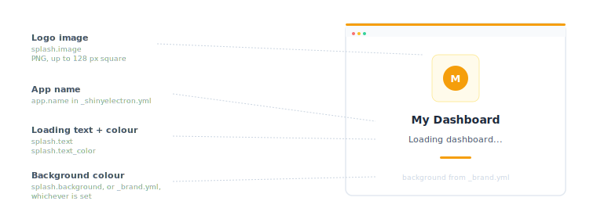
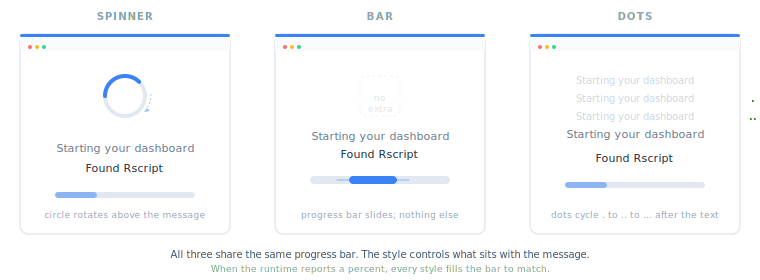
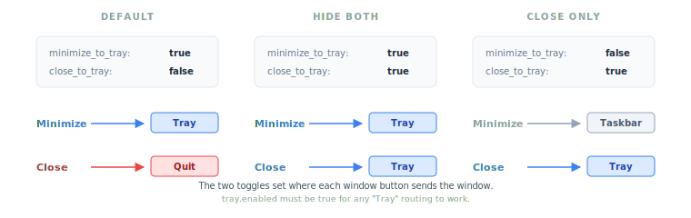
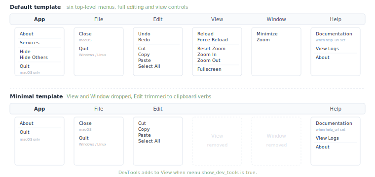

```{r}
#| include: false
library(shinyelectron)
```

Three things sit around your Shiny content in a desktop build: a loading window that fills the gap while the app starts, an optional icon that lives in the system tray, and a native menu bar with the keyboard shortcuts users expect. shinyelectron sets up sensible defaults for each. This guide is what to change when the defaults are not enough.

## Lifecycle window

When the user double-clicks your app, the Electron window opens within a few hundred milliseconds. The runtime behind the Shiny app takes longer than that to come up, especially the first time. The lifecycle window fills the gap with feedback, then hands the same window over to the Shiny app once the runtime is ready.

This applies to every [runtime strategy](runtime-strategies.html). For native R or Python the runtime is a child process; for shinylive it is WebR or Pyodide booting in the browser; for the container strategy it is Docker pulling and starting the image. Each takes seconds to ready up, and each surfaces its progress through the same lifecycle window.

It moves through several phases. You configure the first two; the rest are driven automatically by what the runtime is doing.

{fig-alt="Three large window-shaped cards in a row connected by dashed arrows. Splash on the left has a yellow stripe and shows a logo, the app name, a loading message, and a pulse bar. Preloader in the middle has a blue stripe and shows a headline, a phase detail, and a 40 percent progress bar. Shiny app on the right has a green stripe and a sketch of a sidebar layout with a chart and table rows. A note below reads: Same Electron window throughout. The user never sees a hand-off. Three smaller pills underneath label the optional automatic states: dependency confirmation when packages are missing, runtime version picker when several R or Python versions are found, and an error state with retry or quit." width="100%"}

| Phase | Shown when | What you control |
|-------|------------|------------------|
| Splash | The app is starting up | Logo image, loading text, text colour |
| Preloader | The runtime is downloading or starting | Headline message |
| Dependency confirmation | Missing R or Python packages were found | (automatic UI) |
| Runtime picker | Several R or Python runtimes are installed | (automatic UI) |
| Error | Anything failed during startup | (automatic UI with Retry / Quit) |

### Splash

The first thing the user sees. By default, the app's name above an animated pulse bar. The pieces you can change are the loading text, its colour, an optional logo image, and how long the splash lingers:

{fig-alt="A sample splash window on the right with three traffic-light dots in the chrome, a yellow logo card containing the letter M centered in a circle, the app name My Dashboard, the loading text Loading dashboard, and a small pulse bar. Four annotations on the left, each connected to the relevant part by a thin dashed line: Logo image (splash.image, PNG up to 128 px square), App name (app.name in _shinyelectron.yml), Loading text and colour (splash.text and splash.text_color), Background colour (splash.background, or from _brand.yml, whichever is set)." width="100%"}

```yaml
splash:
  text: "Loading dashboard..."
  text_color: "#eaeaea"
  image: "assets/logo.png"
  duration: 1500
  background: "#1a1a2e"
```

| Option | Description | Default |
|--------|-------------|---------|
| `enabled` | Show the splash state at all; if `false`, the lifecycle window opens directly to the preloader | `true` |
| `duration` | Minimum display time in milliseconds before transitioning out of the splash | `1500` |
| `text` | Loading text shown under the logo | `"Loading..."` |
| `text_color` | Colour of the loading text (hex or CSS colour) | `"#333333"` |
| `image` | Path to a PNG logo, relative to the app directory; rendered at up to 128 px square | none |
| `background` | Background colour of the lifecycle window during the splash phase (hex or CSS colour) | `null` (inherit from `_brand.yml`) |

If you set `splash.background`, that wins. Otherwise the window inherits its background colour from [`_brand.yml > color > background`](https://posit-dev.github.io/brand-yml/), and falls back to a soft off-white (`#f8fafc`) when no brand file is present.

If you do not set any splash keys at all, the splash still shows: the app name comes from `app.name`, and the rest uses defaults. Override only the keys you care about.

::: {.callout-tip}
A PNG with a transparent background sits cleanly on whatever colour the lifecycle window happens to use, light or dark.
:::

### Preloader

Once the runtime starts emitting status events ("Starting Shiny server", "Downloading R 4.4.1", and so on), the splash gives way to the preloader: a headline message, a phase detail line, and a progress bar. You set the headline and the visual style of the loading indicator; the phase detail and bar come from the runtime itself.

```yaml
preloader:
  message: "Starting your dashboard..."
  style: "spinner"
  background: "#0f172a"
```

| Option | Description | Default |
|--------|-------------|---------|
| `message` | Headline shown above the phase detail | `"Loading application..."` |
| `style` | Loading indicator: `"spinner"`, `"bar"`, or `"dots"` | `"spinner"` |
| `background` | Background colour during the preloader phase | `null` (inherit from `_brand.yml`) |

The three styles render differently above the progress bar:

{fig-alt="Three columns labelled SPINNER, BAR, and DOTS, each showing a stylised lifecycle window with the same headline (Starting your dashboard), phase detail (Found Rscript), and a 40 percent progress bar. The spinner column has a partial circle indicator at the top of the window. The bar column has no top indicator; only the progress bar signals activity. The dots column shows the headline ending in three coloured dots. A caption notes that the progress bar fills to a percent when the runtime reports one and otherwise animates indeterminately." width="100%"}

- **`spinner`** adds a small rotating circle above the message.
- **`bar`** shows only the progress bar; the message and detail sit above it.
- **`dots`** appends an animated `.`, `..`, `...` to the message.

When the runtime reports a percent-complete (e.g. during a runtime download), the progress bar fills accordingly regardless of style.

## System tray

The system tray (the menu bar on macOS, the system tray on Windows, the system area on Linux) lets your app live between window appearances. An icon sits in the tray, a click brings the window back, and the runtime keeps going whether the window is open or not.

Reach for it when:

- A background process should keep running while the window is hidden.
- Users expect the app to stay reachable from the OS chrome rather than the dock.
- You want a one-click reopen path without keeping the window visible.

{fig-alt="A stylised macOS-style menu bar at the top right shows three faded system icons (battery, wifi, bluetooth) followed by a highlighted yellow tray icon labelled M and a clock reading 10:42 AM. Below the bar, a dark tooltip reads My Dashboard. Underneath the tooltip, a white drop-down menu has two items separated by a thin divider: Show window and Quit. Three labels on the left, each connected by a thin dashed line to the corresponding visual: Tray icon (your app's icon by default; override with tray.icon), Tooltip on hover (tray.tooltip, defaults to the app name), Right-click menu (built in: Show window, Quit; opens with left-click on macOS). A caption at the bottom reads: The tray icon keeps the app reachable when no window is open. minimize_to_tray and close_to_tray decide when the window hides there." width="100%"}

The simplest configuration enables the tray and inherits everything else:

```yaml
tray:
  enabled: true
```

Everything else defaults sensibly: the icon comes from `app.icon`, the tooltip from `app.name`, and the buttons behave as users expect. To override:

```yaml
tray:
  enabled: true
  minimize_to_tray: true   # Minimize button hides to tray
  close_to_tray: false     # Close button still quits
  tooltip: "My Dashboard"  # Hover text on the icon
  icon: "tray-icon.png"    # Custom tray icon (optional)
```

| Option | Description | Default |
|--------|-------------|---------|
| `enabled` | Turn on the tray icon | `false` |
| `minimize_to_tray` | Minimize button hides the window to the tray | `true` |
| `close_to_tray` | Close button hides to the tray instead of quitting | `false` |
| `tooltip` | Text shown when the user hovers the icon | App name |
| `icon` | Path to a custom tray icon | App icon |

### What the buttons do

The two toggles route the window's minimize and close buttons:

{fig-alt="Three columns each labelled with a header: DEFAULT, HIDE BOTH, CLOSE ONLY. Under each header, a small grey card shows the two config values: minimize_to_tray and close_to_tray with their boolean settings. Below each card, two coloured rows show where each window button sends the window. Default routes Minimize to a blue Tray chip and Close to a red Quit chip. Hide both routes both Minimize and Close to blue Tray chips. Close only routes Minimize to a grey Taskbar chip and Close to a blue Tray chip. A caption notes that tray.enabled must be true for any Tray routing to work." width="100%"}

| `minimize_to_tray` | `close_to_tray` | Minimize button | Close button |
|--------------------|-----------------|-----------------|--------------|
| `true` | `false` | Hide to tray | Quit |
| `true` | `true` | Hide to tray | Hide to tray |
| `false` | `true` | Minimize | Hide to tray |

### Tray menu

Right-clicking the tray icon (or left-clicking on macOS) opens a built-in menu with two entries:

- **Show** brings the window forward.
- **Quit** exits the app.

### Tray icon, per platform

| Platform | Format | Recommended size |
|----------|--------|------------------|
| macOS | PNG (template) | 16×16 or 32×32 |
| Windows | ICO or PNG | 16×16 to 256×256 |
| Linux | PNG | 16×16 to 512×512 |

::: {.callout-note}
On macOS, supply a *template* image: solid black with transparency. The system inverts it for light and dark mode automatically.
:::

## Application menu

Users expect File, Edit, View, and Help menus and the keyboard shortcuts their OS provides. Electron does not give you these by default. shinyelectron generates one for you and follows each platform's conventions.

The default template is on automatically, so the simplest configuration is no configuration. To switch to the minimal template, or wire a documentation URL, set only the keys you need:

```yaml
menu:
  template: "minimal"
  help_url: "https://docs.example.com"
```

The full set of options:

```yaml
menu:
  enabled: true
  template: "default"        # "default" or "minimal"
  show_dev_tools: false      # Adds "Toggle Developer Tools" to View
  help_url: "https://docs.example.com"
```

| Option | Description | Default |
|--------|-------------|---------|
| `enabled` | Build a native application menu | `true` |
| `template` | `"default"` (full menu) or `"minimal"` (essentials only) | `"default"` |
| `show_dev_tools` | Add a DevTools toggle to the View menu | `false` |
| `help_url` | URL opened by Help → Documentation | none |

### What each template ships

{fig-alt="Two stacked menu visualisations. The top half is labelled Default template and shows a horizontal menu bar with six entries (App, File, Edit, View, Window, Help) above six drop-down panels listing each menu's items: App with About, Services, Hide, Hide Others, Quit (macOS only); File with Close on macOS or Quit on Windows or Linux; Edit with Undo, Redo, Cut, Copy, Paste, Select All; View with Reload, Force Reload, Reset Zoom, Zoom In, Zoom Out, Fullscreen; Window with Minimize and Zoom; Help with Documentation (when help_url set), View Logs, About. The bottom half is labelled Minimal template with the same layout but the View and Window menus are shown as faded dashed-outline cards labelled removed, and the Edit menu is trimmed to only Cut, Copy, Paste, Select All. App, File, and Help are unchanged. A caption notes that DevTools adds to View when menu.show_dev_tools is true." width="100%"}

**`default`** is the full application menu:

- **App** (macOS only) About, Services, Hide, Hide Others, Quit
- **File** Close (macOS) / Quit (Windows, Linux)
- **Edit** Undo, Redo, Cut, Copy, Paste, Select All
- **View** Reload, Force Reload, Reset Zoom, Zoom In, Zoom Out, Fullscreen
- **Window** Minimize, Zoom
- **Help** Documentation (when `help_url` is set), View Logs, About

**`minimal`** drops View and Window, and trims Edit to clipboard verbs:

- **App** (macOS only) About, Quit
- **File** Close (macOS) / Quit (Windows, Linux)
- **Edit** Cut, Copy, Paste, Select All
- **Help** Documentation (when `help_url` is set), View Logs, About

### Platform conventions

macOS, Windows, and Linux disagree about where Quit lives. The generated menu honors each one rather than picking a single layout and forcing it everywhere.

| Platform | App-name menu? | Quit menu item | Keyboard shortcut |
|----------|----------------|----------------|-------------------|
| macOS | Yes (About, Services, Hide, Quit) | App-name menu | Cmd+Q |
| Windows | No | File menu | (none bound) |
| Linux | No | File menu | (none bound) |

On Windows, Alt+F4 is an OS-level shortcut that closes the active window. That is distinct from the menu's Quit item, and is what `close_to_tray` intercepts when enabled.

### DevTools

Set `menu.show_dev_tools: true` during development to add **View → Toggle Developer Tools**. Users open it with Cmd+Option+I (macOS) or Ctrl+Shift+I (Windows, Linux). Leave it off in production builds: DevTools lets anyone in the page inspect and execute JavaScript, which is exactly what you do not want a shipped app to allow. See [Security Considerations](security.html) for the longer version.

While iterating on the lifecycle window itself, you can also set the environment variable `ELECTRON_DEV_TOOLS=true` at launch. The Electron shell opens DevTools automatically as soon as the window is ready, regardless of `menu.show_dev_tools`. Useful when the lifecycle splash flashes by too quickly to inspect the menu first.

## Wiring it all together

A complete config that uses all three knobs at once. Drop this into `_shinyelectron.yml` and adjust to taste:

```yaml
app:
  name: "My Dashboard"
  version: "1.0.0"

splash:
  text: "Loading dashboard..."
  image: "assets/logo.png"
  background: "#1a1a2e"
  text_color: "#eaeaea"
  duration: 2000

preloader:
  message: "Starting your dashboard..."
  style: "spinner"

tray:
  enabled: true
  close_to_tray: true
  tooltip: "My Dashboard (running)"

menu:
  template: "minimal"
  help_url: "https://docs.example.com/my-dashboard"
```

That gives you a dark branded splash that lingers for two seconds, a spinner during runtime startup, a tray icon that holds onto the app when the user closes the window, and a clean three-menu bar with a Help → Documentation entry pointing at your docs. Every other key uses its default.

## Editing config from R

`_shinyelectron.yml` is just a YAML file. When you want to set things from R, read it with `read_config()` (which validates as it loads, so bad values warn and fall back to defaults), mutate the list, and write it back:

```{r}
#| eval: false
config <- read_config("path/to/app")

config$tray$enabled <- TRUE
config$tray$close_to_tray <- TRUE
config$splash$text <- "Loading dashboard..."

yaml::write_yaml(config, file.path("path/to/app", "_shinyelectron.yml"))
```

Useful for project setup scripts, CI templating, or any case where you want the configuration to live alongside the code that depends on it.

## Next steps

- **[Configuration](configuration.html)** for the full `_shinyelectron.yml` reference.
- **[Auto Updates](auto-updates.html)** to keep installed apps current.
- **[Security Considerations](security.html)** for the rules around DevTools and shipped builds.
- **[Troubleshooting](troubleshooting.html)** when something is not behaving the way the docs say it should.
