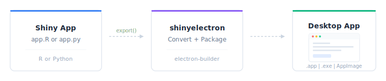
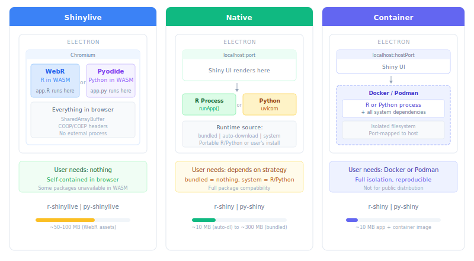

```{r}
#| include: false
library(shinyelectron)
```

Turn any Shiny app --- R or Python --- into a standalone desktop application
that runs on macOS, Windows, and Linux. No web server, no browser tab, no
deployment infrastructure. Just an `.app`, `.exe`, or AppImage your users
double-click to open.

{width="100%"}

## Install

```{r}
#| eval: false
install.packages("pak")
pak::pak("coatless-rpkg/shinyelectron")
```

## Check your system

```{r}
#| eval: false
library(shinyelectron)
sitrep_shinyelectron()
```

This checks Node.js (>= 22.0.0), npm, R packages, Python availability,
and platform build tools. If Node.js is missing, install it locally ---
no admin rights needed:

```{r}
#| eval: false
install_nodejs()
```

## Try a demo

The fastest way to see shinyelectron in action is with a bundled demo:

```{r}
#| eval: false
# List available demos
available_examples()

# Export the R single-app demo to your Desktop
export(
  appdir = example_app("r-single"),
  destdir = "~/Desktop/my-first-app",
  run_after = TRUE
)
```

This converts the demo to shinylive format, wraps it in Electron, builds
a distributable, and opens the app. The whole process takes about a minute.

## Export your own app

### Shinylive (browser-based)

The default path converts your Shiny app to run entirely inside
the browser via WebR (R) or Pyodide (Python). The end user needs
nothing installed --- everything is self-contained.

::: {.panel-tabset}

#### R

```{r}
#| eval: false
export(
  appdir = "path/to/my-app",       # directory containing app.R
  destdir = "my-electron-app",
  app_name = "My App"
)
```

#### Python

```{r}
#| eval: false
export(
  appdir = "path/to/my-py-app",    # directory containing app.py
  destdir = "my-py-electron-app",
  app_name = "My App",
  app_type = "py-shinylive"
)
```

:::

### Native (runtime-based)

Some R and Python packages don't work in WebAssembly. For full
compatibility, use the native path --- your app runs in a real R or
Python process instead of in the browser.

```{r}
#| eval: false
# R Shiny with auto-download (default: downloads R on first launch)
export(
  appdir = "path/to/my-app",
  destdir = "my-native-app",
  app_type = "r-shiny"
)

# Python Shiny with bundled runtime (ships Python inside the app)
export(
  appdir = "path/to/my-py-app",
  destdir = "my-bundled-py-app",
  app_type = "py-shiny",
  runtime_strategy = "bundled"
)
```

{width="100%"}

## Choosing an app type

| App Type | Entry File | Runs In | User Needs | Best For |
|----------|-----------|---------|-----------|----------|
| `r-shinylive` | `app.R` | Browser (WebR) | Nothing | Simple R apps |
| `py-shinylive` | `app.py` | Browser (Pyodide) | Nothing | Simple Python apps |
| `r-shiny` | `app.R` | R process | R (or bundled) | Full R package support |
| `py-shiny` | `app.py` | Python process | Python (or bundled) | Full Python package support |

For native app types, the `runtime_strategy` controls how the runtime
reaches the end user:

| Strategy | How it Works | App Size | First Launch |
|----------|-------------|----------|-------------|
| `auto-download` | Downloads R/Python on first launch | Small | Needs internet |
| `bundled` | Ships R/Python inside the app | Large (~200MB+) | Instant, offline |
| `system` | Uses R/Python already on the machine | Smallest | Requires pre-install |
| `container` | Runs inside Docker/Podman | Small | Needs Docker |

See [Runtime Strategies](runtime-strategies.html) for a deep dive on each.

## What you get

After export, your destination directory looks like this:

```
my-electron-app/
├── shinylive-app/          # Converted app (shinylive types only)
└── electron-app/
    ├── src/app/            # Your application files
    ├── main.js             # Electron shell
    ├── package.json
    ├── node_modules/
    └── dist/               # Ready-to-distribute binaries
        ├── mac-arm64/
        │   └── My App.app
        ├── win-x64/
        │   └── My App Setup.exe
        └─��� linux-x64/
            └── My App.AppImage
```

## Build for multiple platforms

```{r}
#| eval: false
export(
  appdir = "my-app",
  destdir = "my-electron-app",
  platform = c("mac", "win", "linux"),
  arch = c("x64", "arm64"),
  overwrite = TRUE
)
```

::: {.callout-note}
macOS apps can only be built on macOS. Windows and Linux apps can be
cross-compiled from macOS, but native builds are more reliable.
:::

## Add a custom icon

```{r}
#| eval: false
export(
  appdir = "my-app",
  destdir = "my-electron-app",
  icon = "icon.icns"   # .icns (macOS), .ico (Windows), .png (Linux)
)
```

## Use a configuration file

For repeated builds, create a `_shinyelectron.yml` in your app directory
instead of passing parameters every time:

```{r}
#| eval: false
init_config("my-app")
```

```yaml
app:
  name: "My Dashboard"
  version: "1.0.0"

build:
  type: "r-shiny"
  runtime_strategy: "bundled"
  platforms: [mac, win]
```

Then export reads the config automatically:

```{r}
#| eval: false
export(appdir = "my-app", destdir = "output")
```

See the [Configuration Guide](configuration.html) for all available options.

## Next steps

- [Configuration Guide](configuration.html) --- all `_shinyelectron.yml` options
- [Runtime Strategies](runtime-strategies.html) --- bundled vs system vs auto-download vs container
- [Multi-App Suites](multi-app-suites.html) --- bundle multiple apps in one shell
- [Code Signing](code-signing.html) --- sign your app for macOS GateKeeper and Windows SmartScreen
- [Troubleshooting](troubleshooting.html) --- common issues and fixes

## Quick reference

| Function | Purpose |
|----------|---------|
| `export()` | Convert and build Shiny app to Electron |
| `app_check()` | Pre-flight validation without building |
| `wizard()` | Interactive config generator |
| `sitrep_shinyelectron()` | Full system diagnostics |
| `install_nodejs()` | Install Node.js locally |
| `available_examples()` | List bundled demo apps |
| `example_app()` | Get path to a demo app |
| `run_electron_app()` | Launch a built Electron app |
| `cache_clear()` | Clear cached runtimes and assets |
