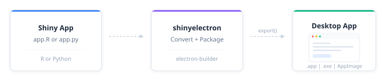
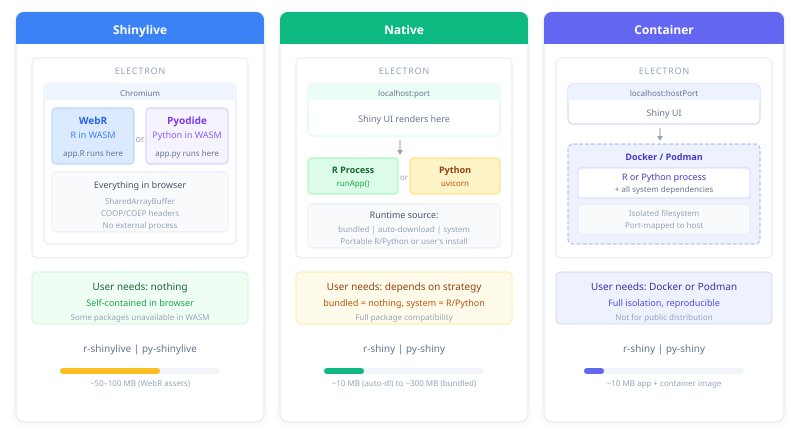

```{r}
#| include: false
library(shinyelectron)
```

Ship a Shiny app as a desktop application. R or Python, macOS, Windows, or Linux. Your users double-click an `.app`, `.exe`, or AppImage. No server, no browser tab, no deployment.

<figure><picture><source srcset="../man/figures/pipeline-overview-dark.svg" media="(prefers-color-scheme: dark)" /></picture><figcaption>The shinyelectron export pipeline: a Shiny app (R or Python) is converted and packaged into a standalone desktop application.</figcaption></figure>

## Install the package

shinyelectron is not on CRAN yet. Install it from GitHub with pak.

```{r}
#| eval: false
install.packages("pak")
pak::pak("coatless-rpkg/shinyelectron")
```

## Run a pre-flight check

Diagnose before you build. It saves hours later.

```{r}
#| eval: false
library(shinyelectron)
sitrep_shinyelectron()
```

`sitrep_shinyelectron()` verifies Node.js (>= 22.0.0), npm, required R packages, Python, and platform build tools. If Node.js is missing, install it locally without admin rights.

```{r}
#| eval: false
install_nodejs()
```

## Build a demo end to end

Ship a bundled example before touching your own app. It confirms the toolchain works.

```{r}
#| eval: false
# List available demos
available_examples()

# Export the R single-app demo to your Desktop
export(
  appdir = example_app("r"),
  destdir = "~/Desktop/my-first-app",
  run_after = TRUE
)
```

One call converts the demo to shinylive, wraps it in Electron, builds a distributable, and launches it. Roughly a minute on a small app.

## Try a prebuilt demo

Prefer to see the result before building your own? Grab a prebuilt demo. These are `shinylive` builds, so they need no R, Python, or internet: download the installer for your platform, run it, and launch the app (on Linux the download is a portable AppImage you can run directly). The [Download Prebuilt Demos guide](https://r-pkg.thecoatlessprofessor.com/shinyelectron/articles/download-demos.html) has a build of every demo for every runtime strategy and platform, or you can browse the [releases page](https://github.com/coatless-rpkg/shinyelectron/releases/latest).

## Export your Shiny app

### Shinylive: runs in the browser

The default runtime strategy compiles your app to WebAssembly. R uses WebR. Python uses Pyodide. Either way, the app runs in the browser, and the browser runs inside Electron. The user installs nothing.

Use this strategy whenever your dependencies allow it. shinyelectron detects the app language from the files in `appdir`, so you usually only need to point at the directory.

```{r}
#| eval: false
# R (language autodetected from app.R, shinylive is the default strategy)
export(
  appdir = "path/to/my-app",       # directory containing app.R
  destdir = "my-electron-app",
  app_name = "My App"
)

# Python (language autodetected from app.py)
export(
  appdir = "path/to/my-py-app",    # directory containing app.py
  destdir = "my-py-electron-app",
  app_name = "My App"
)
```

### Native: runs a real R or Python process

Some packages do not compile to WebAssembly. For those, spawn a real R or Python process behind the Electron window by picking a non-shinylive `runtime_strategy`.

```{r}
#| eval: false
# R Shiny with auto-download (downloads R on first launch)
export(
  appdir = "path/to/my-app",
  destdir = "my-native-app",
  runtime_strategy = "auto-download"
)

# Python Shiny with a bundled runtime (ships Python inside the app)
export(
  appdir = "path/to/my-py-app",
  destdir = "my-bundled-py-app",
  runtime_strategy = "bundled"
)
```

<figure><picture><source srcset="../man/figures/app-types-dark.svg" media="(prefers-color-scheme: dark)" /></picture><figcaption>Three execution modes: Shinylive runs entirely in-browser, Native spawns a real R or Python process, and Container runs inside Docker or Podman.</figcaption></figure>

## Choose an app type and runtime strategy

Two dials drive every shinyelectron build: the app language (`app_type`) and how the runtime reaches the user (`runtime_strategy`). shinyelectron autodetects `app_type` from the files in `appdir`, so you usually set only the strategy.

| App Type | Entry File | Best For |
|----------|-----------|----------|
| `r-shiny` | `app.R` | R Shiny apps |
| `py-shiny` | `app.py` | Python Shiny apps |

`runtime_strategy` decides how your code actually runs. All five strategies work with both `r-shiny` and `py-shiny`.

| Strategy | Behavior | App Size | First Launch | Best For |
|----------|----------|----------|--------------|----------|
| `shinylive` | Compiles app to WebAssembly, runs in-browser | Medium | Instant, offline | Simple apps whose deps run in WebR or Pyodide (default) |
| `auto-download` | Downloads R/Python on first launch | Small | Needs internet | Public distribution, smaller download |
| `bundled` | Ships R/Python inside the app | Large (~200MB+) | Instant, offline | Public distribution, offline first run |
| `system` | Uses R/Python already installed | Smallest | Requires pre-install | Internal tools for users who already have R or Python |
| `container` | Runs inside Docker/Podman | Small | Needs Docker | Complex system dependencies, reproducibility |

See [Runtime Strategies](runtime-strategies.html) for when to pick each.

## What export produces

`export()` writes two siblings into `destdir`: the prepared app and the Electron project that wraps it. The app is then copied into `electron-app/src/app/`, which is the path Electron actually loads at runtime.

```
my-electron-app/
├── shinylive-app/          # shinylive strategy: WebAssembly bundle
│   (or shiny-app/)         # other strategies: app source plus a manifest
└── electron-app/
    ├── src/app/            # Copy of the sibling above (what Electron loads)
    ├── main.js             # Electron entry point
    ├── renderer.html
    ├── package.json
    ├── node_modules/
    └── dist/               # Ready-to-distribute binaries
        ├── my-app-1.0.0-arm64.dmg          # macOS disk image
        ├── mac-arm64/
        │   └── My App.app
        ├── my-app-Setup-1.0.0-x64.exe      # Windows installer
        └── my-app-1.0.0-x86_64.AppImage    # Linux app
```

Ship `dist/`. The rest is build scaffolding, though the sibling app directory is useful when you want to inspect exactly what Electron is serving. Installer names use the app's slug (`my-app`, derived from `"My App"`), its version, and the architecture; the installed app shows the display name.

## Build for several platforms in one call

Pass vectors to `platform` and `arch` to produce several targets in one call.

```{r}
#| eval: false
export(
  appdir = "my-app",
  destdir = "my-electron-app",
  platform = c("mac", "win", "linux"),
  arch = c("x64", "arm64"),
  overwrite = TRUE
)
```

Not every combination is portable. Two rules to keep in mind:

- **macOS apps build only on macOS.** Apple's signing and `.app` packaging run through native tools, so `export()` stops when asked for a `mac` target on Windows or Linux. Windows and Linux installers are not reliably cross-compiled from a macOS host; each platform's installer is most reliably produced by building on that platform's own OS.
- **The `bundled` and `auto-download` strategies need a per-platform build.** Both embed a single platform-specific runtime (or a manifest pointing to one) at export time and abort when more than one platform or architecture is requested. Build each target separately, or use `system`, `container`, or `shinylive` for multi-platform builds from a single host.

In practice, if you want a single workstation to emit installers for every OS, reach for `system`, `container`, or `shinylive`. If you want `bundled` everywhere, hand the job to CI (see the [GitHub Actions](github-actions.html) article).

## Give the app a custom icon

Point `icon` at a single file. A PNG of 1024×1024 pixels or larger works for every platform: electron-builder converts it to `.icns` for macOS and `.ico` for Windows. An `.icns` file works everywhere too. An `.ico` file serves only Windows; the other platforms then show the default Electron icon.

```{r}
#| eval: false
export(
  appdir = "my-app",
  destdir = "my-electron-app",
  icon = "icon.png"
)
```

## Capture build settings in a config file

Once your build options are settled, move them out of the function call and into `_shinyelectron.yml` alongside your app.

```{r}
#| eval: false
init_config("my-app")
```

```yaml
app:
  name: "My Dashboard"
  slug: "my-dashboard"
  version: "1.0.0"

build:
  type: "r-shiny"
  runtime_strategy: "shinylive"
```

`export()` picks it up automatically.

```{r}
#| eval: false
export(appdir = "my-app", destdir = "output")
```

Without `platforms` and `architectures` in the file, `export()` builds for the machine it runs on. List them to build several targets in one call. The rules above still apply, so this example needs a Mac:

```yaml
build:
  platforms: [mac, win]
  architectures: [x64, arm64]
```

Leave out `architectures` and every platform is built for the architecture of the machine you are on. On an Apple Silicon Mac, that means Windows installers for arm64, which most Windows PCs cannot run. The `platform` and `arch` arguments override these lists, each its own, so adding `platform = "win"` to the call builds only the Windows installers, still for both architectures.

See the [Configuration Guide](configuration.html) for every option.

## Where to go next

- [Configuration Guide](configuration.html): every `_shinyelectron.yml` option
- [Runtime Strategies](runtime-strategies.html): bundled, system, auto-download, container
- [Multi-App Suites](multi-app-suites.html): bundle several apps in one shell
- [Code Signing](code-signing.html): sign for macOS GateKeeper and Windows SmartScreen
- [Troubleshooting](troubleshooting.html): common issues and fixes

## Function cheat sheet

| Function | Purpose |
|----------|---------|
| `export()` | Convert and build Shiny app to Electron |
| `app_check()` | Pre-flight validation without building |
| `wizard()` | Interactive config generator |
| `sitrep_shinyelectron()` | Full system diagnostics |
| `install_nodejs()` | Install Node.js locally |
| `available_examples()` | List bundled demo apps |
| `example_app()` | Get path to a demo app |
| `run_electron_app()` | Launch a built Electron app |
| `cache_clear()` | Clear cached runtimes and assets |
