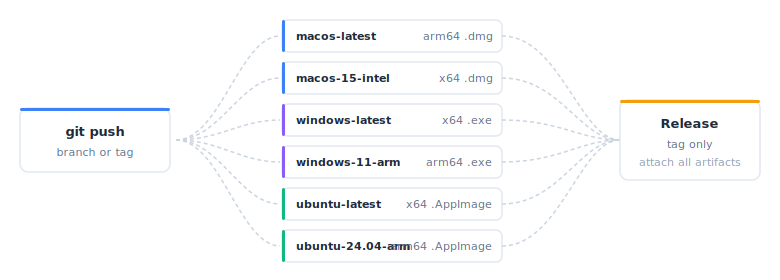

```{r}
#| include: false
library(shinyelectron)
```

Desktop builds demand a Mac, a Windows box, and a Linux box. GitHub Actions rents you all three and runs them in parallel. One push, six installers.

{fig-alt="A git push node on the left fans out to six runner rows (macos-latest, macos-15-intel, windows-latest, windows-11-arm, ubuntu-latest, ubuntu-24.04-arm), each producing a platform-specific installer, which fan back in to a Release job on the right that runs only on tag pushes."}

## Why automate

Manual cross-platform builds are slow and hard to reproduce.

| Problem | What CI solves |
|---------|----------------|
| Needing Windows, macOS, and Linux hardware | Runners for each platform |
| Builds drift on a developer laptop | Clean, versioned environments every run |
| Uploading binaries by hand | Artifacts and releases from a step |
| Platform regressions | Parallel matrix catches them early |

## Before you start

You need:

1. A GitHub repo containing your Shiny app.
2. The app in a subdirectory, `app/` by default.
3. Optionally, a `_shinyelectron.yml` alongside the app.

A typical layout:

```
my-shiny-project/
├── .github/
│   └── workflows/
│       └── build-electron.yml   # Workflow file
├── app/
│   ├── app.R                    # Your Shiny app
│   └── ...
├── _shinyelectron.yml           # Optional config
└── README.md
```

## Quick start

### Copy the template

shinyelectron ships a ready-to-run workflow. Drop it into your repo.

```{r}
#| eval: false
# Find the template location
template_path <- system.file(
 "templates",
 "github-actions-build.yml",
 package = "shinyelectron"
)

# View the template
file.show(template_path)

# Copy to your project (run from your project root)
dir.create(".github/workflows", recursive = TRUE, showWarnings = FALSE)
file.copy(
 template_path,
 ".github/workflows/build-electron.yml"
)
```

You can also grab it directly from
<https://github.com/coatless-rpkg/shinyelectron/blob/main/inst/templates/github-actions-build.yml>.

### Tune the variables

Open `.github/workflows/build-electron.yml` and set four env vars at the top.

```yaml
env:
 APP_DIR: 'app'           # Directory containing your Shiny app
 APP_NAME: 'MyApp'        # Name of your application
 NODE_VERSION: '22'       # Node.js version
 R_VERSION: 'release'     # R version
```

### Push

Commit, push, and the workflow fires on `main` or `master`.

```bash
git add .github/workflows/build-electron.yml
git commit -m "Add Electron build workflow"
git push
```

## What the workflow contains

Three jobs run in sequence: a build matrix, a release step gated on tags, and a summary.

### Build

The matrix spreads six installers across six runners. Each runner starts from a clean image.

| Runner | Platform | Architecture | CPU / RAM | Output |
|--------|----------|--------------|-----------|--------|
| `macos-latest` | macOS | arm64 (M1) | 3 cores / 7 GB | `.dmg` |
| `macos-15-intel` | macOS | x64 (Intel) | 4 cores / 14 GB | `.dmg` |
| `windows-latest` | Windows 2025 | x64 | 4 cores / 16 GB | `.exe` |
| `ubuntu-latest` | Ubuntu 24.04 | x64 | 4 cores / 16 GB | `.AppImage` |
| `ubuntu-24.04-arm` | Ubuntu 24.04 | arm64 | 4 cores / 16 GB | `.AppImage` |
| `windows-11-arm` | Windows 11 | arm64 | 4 cores / 16 GB | `.exe` |

Every runner steps through the same recipe:

1. Checkout the repo.
2. Set up R with r-lib/actions.
3. Set up Node.js 22.
4. Install shinyelectron and its dependencies.
5. Run `shinyelectron::export()`.
6. Upload the build output as a run artifact.

### Release

Pushing a tag like `v1.0.0` unlocks a second job. It downloads every build artifact, creates a GitHub Release named after the tag, and attaches the installers.

### Summary

A recap job writes build status to the Actions UI so failures are easy to spot.

## Customizing

### App in a different folder

Override `APP_DIR`.

```yaml
env:
 APP_DIR: 'src/shiny-app'  # Custom location
```

### Narrower platform list

Trim the matrix to what you ship.

```yaml
matrix:
 include:
   # Only macOS and Windows
   - os: macos-latest
     platform: mac
     arch: arm64
   - os: windows-latest
     platform: win
     arch: x64
```

### Config file wins, workflow overrides

A `_shinyelectron.yml` in the app directory is picked up automatically. Workflow parameters override its values.

```yaml
app:
 name: "My Shiny Dashboard"
 version: "1.0.0"

window:
 width: 1400
 height: 900

build:
 type: "r-shiny"
 runtime_strategy: "shinylive"
```

### Custom icons

Ship icons from the repo and pass them to `export()`.

```yaml
- name: Build Electron app
 run: |
   Rscript -e "
     shinyelectron::export(
       appdir = '${{ env.APP_DIR }}',
       destdir = 'build',
       icon = 'assets/icon.icns',
       # ... other options
     )
   "
```

::: {.callout-note}
Icon requirements:

- macOS: `.icns` (build with `iconutil`)
- Windows: `.ico` (multi-resolution)
- Linux: `.png` (512x512)
:::

## Cutting releases

### Automatic from a tag

Push a version tag. The release job builds everything and attaches the artifacts.

```bash
git tag v1.0.0
git push origin v1.0.0
```

### Pre-releases

Tags containing `-alpha` or `-beta` are marked as pre-releases automatically.

```bash
git tag v1.0.0-beta.1
git push origin v1.0.0-beta.1
```

### On demand

The workflow exposes `workflow_dispatch` so you can build any branch on demand.

1. Open Actions, pick Build Electron App.
2. Click Run workflow.
3. Choose a branch and run it.

## Going further

### Caching

npm caching is built in. R packages are worth caching too:

```yaml
- name: Setup R
 uses: r-lib/actions/setup-r@v2
 with:
   r-version: ${{ env.R_VERSION }}
   use-public-rspm: true

- name: Cache R packages
 uses: actions/cache@v4
 with:
   path: ${{ env.R_LIBS_USER }}
   key: ${{ runner.os }}-r-${{ hashFiles('**/DESCRIPTION') }}
```

### Status badge

Drop a badge in your README so contributors see build state at a glance.

```markdown
[](https://github.com/YOUR-USERNAME/YOUR-REPO/actions/workflows/build-electron.yml)
```

### Code signing

Signing requires a certificate and a few environment variables.

macOS:

```yaml
env:
 CSC_LINK: ${{ secrets.MAC_CERTIFICATE }}
 CSC_KEY_PASSWORD: ${{ secrets.MAC_CERTIFICATE_PASSWORD }}
 APPLE_ID: ${{ secrets.APPLE_ID }}
 APPLE_APP_SPECIFIC_PASSWORD: ${{ secrets.APPLE_APP_SPECIFIC_PASSWORD }}
```

Windows:

```yaml
env:
 CSC_LINK: ${{ secrets.WIN_CERTIFICATE }}
 CSC_KEY_PASSWORD: ${{ secrets.WIN_CERTIFICATE_PASSWORD }}
```

::: {.callout-warning}
Certificates come from Apple and a Windows CA. Unsigned apps trigger Gatekeeper and SmartScreen warnings.
:::

### Secrets

Keep credentials in GitHub Secrets, not in the workflow file.

1. Settings, then Secrets and variables, then Actions.
2. New repository secret.
3. Add the value (for example, `MAC_CERTIFICATE`).

Reference it by name:

```yaml
env:
 MY_SECRET: ${{ secrets.MY_SECRET_NAME }}
```

## Troubleshooting

### Linux build fails on missing libraries

Install system packages before the build.

```yaml
- name: Install system dependencies (Linux)
 if: runner.os == 'Linux'
 run: |
   sudo apt-get update
   sudo apt-get install -y libcurl4-openssl-dev libxml2-dev
```

### "App directory 'app' not found"

Either your app lives elsewhere, or `APP_DIR` still points at the default. Line them up.

### R package install fails

Either the package is not on CRAN, or its repo is missing from the install step.

```yaml
- name: Install R dependencies
 uses: r-lib/actions/setup-r-dependencies@v2
 with:
   extra-packages: |
     any::shinyelectron
     github::user/package
```

### Job hits the six-hour limit

Shrink the matrix, cache more aggressively, or split the build across workflows.

### "No files found" on upload

The artifact path does not match reality. List the directory to confirm.

```yaml
- name: Debug build output
 run: ls -laR build/
 shell: bash
```

### Diagnostics with sitrep

`sitrep_shinyelectron()` prints the same environment inventory the package uses locally. Handy when a runner misbehaves.

```yaml
- name: Run diagnostics
 run: |
   Rscript -e "
     library(shinyelectron)
     sitrep_shinyelectron()
   "
```

## A minimal end-to-end example

Repo layout:

```
my-app/
├── .github/workflows/build-electron.yml
├── app/
│   └── app.R
└── README.md
```

`app/app.R`:

```r
library(shiny)

ui <- fluidPage(
 titlePanel("Hello Shiny!"),
 sliderInput("n", "Number:", 1, 100, 50),
 textOutput("result")
)

server <- function(input, output) {
 output$result <- renderText(paste("You selected:", input$n))
}

shinyApp(ui, server)
```

Push to `main` for a build, push `v1.0.0` for a release.

## Next steps

- [Getting Started](getting-started.html): local development workflow.
- [Configuration](configuration.html): customize with `_shinyelectron.yml`.
- [Troubleshooting](troubleshooting.html): diagnose build issues.
