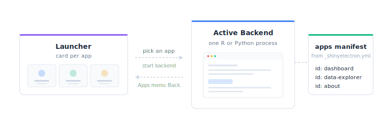

```{r}
#| include: false
library(shinyelectron)

# Helper: render a directory tree from a bundled demo, stripped of any ANSI
# colour codes and with the absolute path swapped for the suite name.
print_demo_tree <- function(suite_dir) {
  root <- system.file(paste0("demos/", suite_dir), package = "shinyelectron")
  output <- capture.output(fs::dir_tree(root))
  output <- cli::ansi_strip(output)
  output[1] <- paste0(suite_dir, "/")
  cat(c("```", output, "```"), sep = "\n")
}

# Helper: render a file from a bundled demo as a fenced code block.
print_demo_file <- function(rel_path, lang = "") {
  path <- system.file(paste0("demos/", rel_path), package = "shinyelectron")
  cat(c(paste0("```", lang),
        readLines(path),
        "```"),
      sep = "\n")
}
```

One repo, many apps, one launcher. A suite bundles several Shiny apps, R or Python, into a single Electron binary. Users open the launcher, pick an app, and switch whenever they like through the **Apps** menu.

{fig-alt="A launcher panel on the left with three app cards. An arrow labelled 'pick an app' leads to an active backend window on the right. A return arrow labelled 'Apps menu: Back' leads from the backend back to the launcher. On the far right, the apps manifest lists dashboard, data-explorer, and about."}

## Layout

A suite is a directory with a `_shinyelectron.yml` at the root and an `apps/` folder. Each subfolder holds a normal Shiny app (`app.R` for R, `app.py` for Python).

### R suite

The bundled demo at `inst/demos/demo-r-app-suite/`, read live:

```{r}
#| echo: false
#| results: asis
print_demo_tree("demo-r-app-suite")
```

### Python suite

The Python demo at `inst/demos/demo-py-app-suite/` adds one file: a `requirements.txt` at the root that covers every app in the suite.

```{r}
#| echo: false
#| results: asis
print_demo_tree("demo-py-app-suite")
```

## Configuration

A top-level `apps` array switches shinyelectron into suite mode. Each entry needs three fields (`id`, `name`, `path`) and accepts four optional ones (`description`, `type`, `runtime_strategy`, `icon`).

### R suite config

Read live from `inst/demos/demo-r-app-suite/_shinyelectron.yml`:

```{r}
#| echo: false
#| results: asis
print_demo_file("demo-r-app-suite/_shinyelectron.yml", lang = "yaml")
```

### Python suite config

Only `build.type` changes. Read live from `inst/demos/demo-py-app-suite/_shinyelectron.yml`:

```{r}
#| echo: false
#| results: asis
print_demo_file("demo-py-app-suite/_shinyelectron.yml", lang = "yaml")
```

### Fields in an `apps` entry

| Field | Required | Description |
|-------|----------|-------------|
| `id` | Yes | Unique identifier (used in file paths and the apps manifest) |
| `name` | Yes | Display name shown on the launcher card |
| `path` | Yes | Relative path from the suite root to the app directory |
| `description` | No | Short text shown below the name on the launcher card |
| `type` | No | Override the default `build.type` for this specific app |
| `runtime_strategy` | No | Override the default `build.runtime_strategy` for this specific app |
| `icon` | No | Path to an icon image displayed on the launcher card |

Every app inherits `build.type` and `build.runtime_strategy` unless it overrides them. Suites can mix languages (some `r-shiny`, some `py-shiny`) and mix strategies (one app on `shinylive`, another on `system`). Most suites stay uniform, but the overrides are there when you need them.

## Mixed-strategy suites

A single suite can bundle apps with different runtime strategies. Set a suite-wide default in `build.runtime_strategy`, then override it per app where it makes sense. This is handy when one app runs fine in the browser (shinylive) while another needs a real process for packages that do not compile to WebAssembly.

```yaml
# _shinyelectron.yml
app:
  name: "Mixed Suite"
  version: "1.0.0"

build:
  type: "r-shiny"
  runtime_strategy: "shinylive"   # suite default

apps:
  - id: "viewer"
    name: "Data Viewer"
    description: "Lightweight tables and charts"
    path: "./apps/viewer"
    # inherits shinylive from build.runtime_strategy

  - id: "modeler"
    name: "Model Fitter"
    description: "Needs packages that are not in WebR"
    path: "./apps/modeler"
    runtime_strategy: "system"    # overrides the suite default
```

Per-app `runtime_strategy:` overrides the suite default for just that app. The other apps keep inheriting the default. You can mix all five strategies this way, with the usual platform caveats (for example, bundled R still needs a portable R build for the target OS).

## How dependencies are handled

R apps can be scanned for dependencies; Python apps cannot. R lets you skip declaration entirely and rely on the source. Python always asks you to write a list, just in one of two files. Both languages can also use `_shinyelectron.yml` for explicit declarations, and lists from any source merge into one install plan.

### R apps

**Automatic.** shinyelectron runs `renv::dependencies()` over each app directory. It picks up `library()`, `require()`, `pkg::func()`, and `loadNamespace()` references in the source. Base and recommended R packages (`stats`, `utils`, `MASS`, `lattice`, and friends) are excluded automatically.

**Explicit.** Add a `dependencies:` block to the suite-level `_shinyelectron.yml`:

```yaml
dependencies:
  r:
    packages: [shiny, ggplot2, dplyr]
    repos: ["https://cloud.r-project.org"]
```

Source-scan and declared packages merge. Set `dependencies.auto_detect: false` to skip the renv scan and install only the declared list.

### Python apps

shinyelectron does not parse `import` statements: the module-name to package-name mapping is unreliable (`import cv2` is `opencv-python`, `import sklearn` is `scikit-learn`). You declare what gets installed, in one of two places.

**`requirements.txt` or `pyproject.toml`.** A standard Python manifest at the suite root. All apps in the suite share one virtual environment. The demo's `requirements.txt`:

```{r}
#| echo: false
#| results: asis
print_demo_file("demo-py-app-suite/requirements.txt")
```

That file covers every app in the suite.

**`_shinyelectron.yml`.** Add a `python` section to the same `dependencies:` block:

```yaml
dependencies:
  python:
    packages: [shiny, numpy, pandas]
    index_urls: ["https://pypi.org/simple"]
```

Manifest-file and YAML packages merge. Set `dependencies.auto_detect: false` to skip reading the manifest and install only the YAML list.

## Exporting a suite

`export()` reads the config, sees an `apps` array with two or more entries, and switches to suite mode. No extra flags.

```{r}
#| eval: false
library(shinyelectron)

# Export the bundled R demo suite
r_suite <- example_app("suite")
export(appdir = r_suite, destdir = "output-r-suite")

# Export a Python suite from your own project
export(appdir = "path/to/my-py-suite", destdir = "output-py-suite")
```

You do not pass `app_type` or `runtime_strategy`. The YAML owns those choices, through `build.type` and `build.runtime_strategy`.

All five [runtime strategies](runtime-strategies.html) (shinylive, system, bundled, auto-download, container) work with suites, exactly as they do with single apps. Per-app overrides let one suite mix them.

## Launcher and app switching

The Electron window opens to a launcher page. Each app gets a card with its name, description, type badge, and icon (your image, or a generated initial).

Click a card: the backend for that app starts, and the window navigates to it. The **Apps** menu offers "Back to Launcher," which stops the backend and returns to the card grid.

### One runtime, one active app

A suite runs a single R or Python process. Switching apps follows four steps:

1. Stop the current backend.
2. Show the launcher.
3. User picks the next app.
4. Start a fresh backend for that app.

Only one app runs at a time. No parallel runtimes, no duplicated processes, no extra installs.

## Building your own suite

From scratch:

1. Create a directory with an `apps/` subfolder.
2. Put each Shiny app in its own subdirectory.
3. Write `_shinyelectron.yml` with an `apps` array listing every app.
4. For Python suites, add `requirements.txt` at the root.
5. Run `export()` on the suite directory.

```{r}
#| eval: false
# Minimal example: create suite structure, then export
export(appdir = "my-suite", destdir = "my-suite-output")
```

The config file is the single source of truth. Two or more entries in `apps`, each pointing at a valid app, and shinyelectron builds the launcher, the menu, and the switching logic for you.
