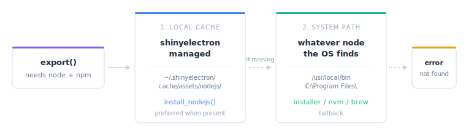

```{r}
#| include: false
library(shinyelectron)
```

Node.js is the engine behind electron-builder. shinyelectron can install a
local copy just for this package, so you do not need a system-wide install
or admin rights.

## Why a local install

A local install lives under your user cache. Four things follow from that.

| Benefit | What it means |
|---------|---------------|
| **No admin rights** | Install without sudo or Administrator |
| **Isolation** | Does not touch the system Node.js or other projects |
| **Reproducibility** | Pin a specific version for consistent builds |
| **Portability** | Works on locked-down machines where a system install is not allowed |

## Installing Node.js

Install the latest LTS (Long Term Support) build.

```{r}
#| eval: false
install_nodejs()
```
```
i Detecting latest Node.js LTS version...
v Latest LTS: v22.11.0
-- Installing Node.js v22.11.0 ----------------------------------------------
i Platform: mac
i Architecture: arm64
i Fetching checksums...
i Downloading from https://nodejs.org/dist/v22.11.0/node-v22.11.0-darwin-arm64.tar.gz
v Checksum verified
i Extracting archive...
v Node.js v22.11.0 installed successfully
i Location: ~/.shinyelectron/cache/assets/nodejs/v22.11.0/darwin-arm64
i shinyelectron will automatically use this installation
```

Pin a specific version when you need reproducible builds.

```{r}
#| eval: false
install_nodejs(version = "20.18.0")
```

Force a reinstall when a previous download is corrupt.

```{r}
#| eval: false
install_nodejs(force = TRUE)
```

## Inspecting what is installed

`sitrep_electron_system()` lists every Node.js version shinyelectron knows
about and which one is active.

```{r}
#| eval: false
sitrep_electron_system()
```
```
-- System Requirements Report ------------------------------------------------
v Platform: darwin
v Architecture: arm64
v Local Node.js (shinyelectron): v22.11.0
  Other versions: 20.18.0
v Active Node.js: v22.11.0 (local)
v npm: v10.9.0
```

You can keep several versions side by side.

```{r}
#| eval: false
install_nodejs(version = "22.11.0")
install_nodejs(version = "20.18.0")
install_nodejs(version = "18.20.0")
```

The most recently installed version wins. If two versions were installed in
the same moment, the higher version wins.

## Where files live

Everything lands under `~/.shinyelectron/cache/assets/nodejs/`, versioned
and keyed by platform and architecture.

```
~/.shinyelectron/cache/assets/nodejs/
|-- v22.11.0/
|   `-- darwin-arm64/      # macOS ARM (M1/M2/M3)
|       |-- bin/
|       |   |-- node       # Node.js executable
|       |   |-- npm        # npm executable
|       |   `-- npx        # npx executable
|       |-- include/
|       `-- lib/
|-- v20.18.0/
|   |-- darwin-arm64/
|   `-- win-x64/           # Windows 64-bit
|       |-- node.exe
|       |-- npm.cmd
|       `-- npx.cmd
`-- ...
```

## Download integrity

Every download is checked against the official SHA256 manifest before it is
trusted. The sequence is:

1. Fetch `SHASUMS256.txt` from nodejs.org.
2. Download the Node.js archive.
3. Compute the SHA256 of the downloaded file.
4. Compare against the expected checksum.
5. Abort on any mismatch.

This catches corrupted downloads and anything tampered with in transit.

## Platform detection

shinyelectron picks the right build by reading `Sys.info()`.

| Platform | Detection | Node.js build |
|----------|-----------|---------------|
| macOS | `Sys.info()[["sysname"]] == "Darwin"` | darwin |
| Windows | `Sys.info()[["sysname"]] == "Windows"` | win |
| Linux | `Sys.info()[["sysname"]] == "Linux"` | linux |

| Architecture | Detection | Node.js arch |
|--------------|-----------|--------------|
| x86-64 | Intel or AMD 64-bit | x64 |
| ARM64 | Apple Silicon, ARM servers | arm64 |

## Auto-install from config

Tell `export()` to fetch Node.js on demand by setting `auto_install: true`
in `_shinyelectron.yml`.

```yaml
nodejs:
  auto_install: true
```

Add a `version` key to pin the install.

```yaml
nodejs:
  version: "22.11.0"
  auto_install: true
```

::: {.callout-note}
## Opt-in only

Auto-install is off by default. You must either set `auto_install: true` or
call `install_nodejs()` yourself. shinyelectron will not download anything
without your say-so.
:::

## Resolution order

When shinyelectron needs Node.js, it looks in two places, in order.

1. **Local install** under `~/.shinyelectron/cache/assets/nodejs/`.
2. **System install** on your PATH.

The local install wins whenever it exists. If neither is available, the
call fails with a clear error.

{fig-alt="Flow diagram showing export() checking the local shinyelectron cache first, falling back to the system PATH, and erroring if neither Node.js install is available."}

To force the system copy (rarely useful):

```{r}
#| eval: false
# Internal function, not typically needed
get_node_command(prefer_local = FALSE)
```

## Clearing the cache

Remove every Node.js install shinyelectron has downloaded.

```{r}
#| eval: false
cache_clear("nodejs")
```
```
v Cleared nodejs cache
```

Remove everything shinyelectron has cached, including Node.js, npm
downloads, and R-related caches.

```{r}
#| eval: false
cache_clear("all")
```

## Troubleshooting

### Network error during download

```
x Failed to download Node.js
x URL: https://nodejs.org/dist/v22.11.0/node-v22.11.0-darwin-arm64.tar.gz
x Error: could not resolve host
```

Check your connection. If you are behind a corporate proxy, make sure R
sees it. If nodejs.org itself is down, try again later.

### Checksum mismatch

```
x Checksum verification failed
x Downloaded file may be corrupted
```

Retry with `force = TRUE` to re-download.

```{r}
#| eval: false
install_nodejs(force = TRUE)
```

If the mismatch persists, nodejs.org may be serving a bad mirror. Wait and
try again.

### Wrong architecture

Symptom: Node.js runs but Electron fails with an architecture mismatch.

Check what was installed, then clear and reinstall.

```{r}
#| eval: false
sitrep_electron_system()
cache_clear("nodejs")
install_nodejs()
```

### Local install skipped

Symptom: shinyelectron keeps reaching for the system Node.js even though
the local install should exist.

The local install is probably incomplete or corrupt. Clear and reinstall,
then verify.

```{r}
#| eval: false
cache_clear("nodejs")
install_nodejs()
sitrep_electron_system()
```

## Local vs system at a glance

| Aspect | Local (shinyelectron) | System |
|--------|-----------------------|--------|
| Installation | `install_nodejs()` | Download from nodejs.org |
| Location | `~/.shinyelectron/cache/` | `/usr/local/`, `C:\Program Files\` |
| Permissions | User-only | Usually requires admin |
| Updates | Manual via `install_nodejs()` | System package manager |
| Isolation | Per-user, isolated | System-wide, shared |
| Multiple versions | Yes | Usually one |

Prefer the local install for most work. It is isolated, reproducible, and
cannot be broken by an OS update.

## Next steps

- **[Getting Started](getting-started.html)**: First-time user walkthrough
- **[Configuration](configuration.html)**: Set Node.js options in config files
- **[Troubleshooting](troubleshooting.html)**: Diagnose other issues
