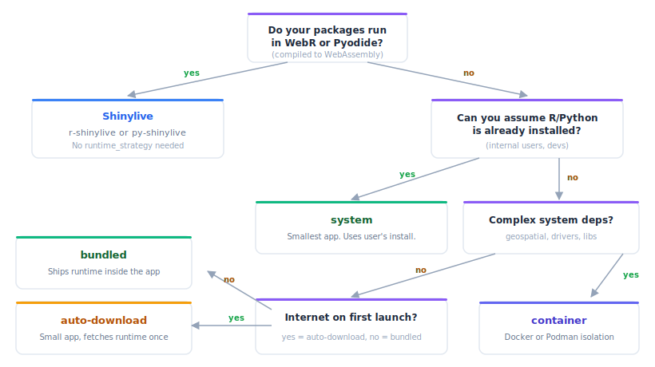

```{r}
#| include: false
library(shinyelectron)
```

The runtime strategy decides how your Shiny app actually runs inside the Electron shell. Five options, five tradeoffs. Pick based on your audience, your dependencies, and whether you can assume internet on first launch.

All five strategies work with both `r-shiny` and `py-shiny`. The default is `shinylive`.

{fig-alt="Flowchart with branching decisions. Top node asks if packages run in WebR or Pyodide; yes leads to Shinylive. No leads to whether the user has R or Python installed; yes leads to the system strategy. No leads to whether the app has complex system dependencies; yes leads to container. No leads to whether the user has internet on first launch; yes leads to auto-download, no leads to bundled." width="100%"}

## Quick pick

| Scenario | Strategy |
|----------|---------------------|
| App runs fine in WebR or Pyodide | `shinylive` |
| Simplest setup, period | `shinylive` |
| Public distribution, minimal friction | `bundled` |
| Internal tool for developers who already have R or Python | `system` |
| Public distribution, smaller download | `auto-download` |
| Complex system dependencies or strict reproducibility | `container` |

## The tradeoffs at a glance

| | Shinylive | System | Bundled | Auto-download | Container |
|--|-----------|--------|---------|---------------|-----------|
| **App size** | 50 to 100 MB | ~5 MB | 150 to 300 MB | ~5 MB | ~5 MB |
| **First launch** | Fast | Fast | Fast | Slow (downloads runtime) | Medium (pulls image) |
| **Offline support** | Full | Full | Full | First launch needs internet | First launch needs internet |
| **User requirements** | None | R or Python installed | None | Internet on first run | Docker or Podman |
| **Dependency isolation** | WebR/Pyodide sandbox | None | Full | Full | Full |
| **Package compatibility** | Limited (WebR/Pyodide) | Complete | Complete | Complete | Complete |
| **Linux support** | Yes | Yes | No (use system or container) | No (use system or container) | Yes |

## Shinylive strategy

Shinylive compiles your app to WebAssembly and runs it entirely in the browser. WebR handles R. Pyodide handles Python. Either way, no server-side process ever starts. The browser runs inside Electron, and the whole thing ships without a real R or Python runtime.

`shinylive` is the default strategy, so a bare call with no explicit strategy picks it automatically.

```{r}
#| eval: false
# Language autodetected from files in appdir; shinylive is the default strategy
export(
  appdir = "my-app",
  destdir = "output"
)

# Equivalent, fully explicit
export(
  appdir = "my-app",
  destdir = "output",
  app_type = "r-shiny",
  runtime_strategy = "shinylive"
)

# Python
export(
  appdir = "my-py-app",
  destdir = "output",
  app_type = "py-shiny",
  runtime_strategy = "shinylive"
)
```

### The export flow

1. `export()` calls the `{shinylive}` R package (for R) or the `shinylive` CLI (for Python) to convert your app to static assets.
2. The Electron app serves those assets over a local Express server with COOP and COEP headers. Those headers enable the `SharedArrayBuffer` that WebR needs.
3. WebR or Pyodide boots inside the browser and runs your code.

### Pros

- Zero runtime dependencies for the user.
- No native child process to manage or clean up.
- Works identically on Windows, macOS, and Linux.

### Cons

- Large app size from the WebR or Pyodide assets (around 50 to 100 MB for R).
- Not every package compiles to WASM. Anything with C or Fortran needs a WebR-compatible build.
- Python packages must exist in Pyodide.
- Slower first paint while the WASM runtime boots.

### When to use

Your packages work in WebR or Pyodide, and you want zero runtime management. Start here.

## System strategy

The system strategy assumes R or Python is already installed. The Electron app spawns `Rscript` or `python3` from the user's `PATH`.

```{r}
#| eval: false
export(
  appdir = "my-app",
  destdir = "output",
  runtime_strategy = "system"
)
```

### The launch flow

1. `export()` packages your app files into the Electron project. No runtime is embedded.
2. At launch, the Electron backend (`native-r.js` or `native-py.js`) spawns `Rscript` or `python3` as a child process.
3. That child starts the Shiny server. Electron connects to it.

### Pros

- Smallest possible app size. Just your code plus the Electron shell.
- No download step. No container engine.
- Whatever the user has installed, works.

### Cons

- The user must have R or Python on `PATH`.
- Package versions drift between machines.
- No dependency isolation.

### When to use

Internal tools shipped to developers or data scientists who already have R or Python. Also useful during local development.

## Bundled strategy

Bundled embeds a complete portable R or Python runtime inside the Electron app at build time. The user needs nothing beyond the app.

Think of it as shipping a laptop with the OS pre-installed. Heavy download, then everything works offline. Auto-download (next section) is the other extreme: ship a setup script, fetch the OS on first boot.

```{r}
#| eval: false
export(
  appdir = "my-app",
  destdir = "output",
  runtime_strategy = "bundled"
)
```

### The build flow

1. During `export()`, shinyelectron downloads a portable runtime and writes it into the Electron project's `resources/` directory.
2. Your app dependencies are installed into that runtime's library.
3. At launch, the Electron backend uses the bundled `Rscript` or `python3` instead of anything on the user's system.

### Platform coverage

Portable R comes from the [portable-r](https://github.com/portable-r) project.

- **Windows**: `portable-r-windows` (x64 and aarch64).
- **macOS**: `portable-r-macos` (arm64 and x86_64).
- **Linux**: no portable R builds exist. Use `system` or `container` for R on Linux.

Portable Python comes from [python-build-standalone](https://github.com/astral-sh/python-build-standalone) by Astral. It covers all three platforms. Python apps work with every strategy on every platform.

### Pros

- Zero user dependencies.
- Works offline from the first launch.
- Full native package compatibility (not WASM).
- Fully isolated from any R or Python already on the machine.

### Cons

- Large app size, 150 to 300 MB depending on runtime and packages.
- No portable R on Linux.
- Longer build time for runtime download and dependency installation.

### When to use

Choose bundled when you cannot assume internet on first launch and you ship to users who do not have R or Python.

## Auto-download strategy

Auto-download ships the app without a runtime, downloads it on first launch, and caches it locally for every launch after.

```{r}
#| eval: false
export(
  appdir = "my-app",
  destdir = "output",
  runtime_strategy = "auto-download"
)
```

### The launch flow

1. `export()` packages the app without a runtime and includes the `runtime-downloader.js` backend.
2. On first launch, the downloader checks a local cache directory. If it finds no runtime, it downloads and extracts a portable build.
3. The runtime is cached per-user: `~/.shinyelectron/cache/` on macOS and Linux, `%LOCALAPPDATA%\shinyelectron\cache\` on Windows.
4. Subsequent launches skip the download and reuse the cached runtime.

The download sources are the same as bundled: portable-r for R, python-build-standalone for Python.

### Pros

- Small initial download. Just your app plus the Electron shell.
- Full package compatibility after the first launch.
- The cached runtime is shared across every shinyelectron app on the machine.

### Cons

- First launch needs internet and takes longer. The user sees a progress screen.
- Same Linux limitation as bundled: no portable R on Linux.

### When to use

A middle ground. Use when the download size matters (GitHub releases, a website) and you can assume internet on first launch.

## Container strategy

The container strategy runs your Shiny app inside a Docker or Podman container. The Electron shell talks to the containerized app over a local port.

```{r}
#| eval: false
export(
  appdir = "my-app",
  destdir = "output",
  runtime_strategy = "container"
)
```

Configure the engine and image in `_shinyelectron.yml`:

```yaml
build:
  type: "r-shiny"
  runtime_strategy: "container"

container:
  engine: "docker"       # or "podman"
  image: "my-org/my-app"
  tag: "latest"
  pull_on_start: true
```

### The launch flow

1. `export()` packages the app and includes the `container.js` backend.
2. At launch, Electron detects Docker or Podman.
3. It pulls the image if `pull_on_start` is true, then starts a container with the app directory mounted.
4. The Shiny server runs inside the container. Electron connects to the exposed port.
5. When the Electron window closes, the container is stopped and removed.

### Pros

- OS-level isolation, not just package-level.
- Runs wherever Docker or Podman runs.
- Handles system dependencies (C libraries, database drivers, geospatial tools) that are hard to bundle portably.
- Reproducible across machines.

### Cons

- The user must have Docker or Podman installed and running.
- First launch can be slow (image pull).
- Container images are often large.
- Docker Desktop requires a commercial license at larger organizations.

### When to use

Best for apps with complex system dependencies or strict reproducibility needs. Also a natural fit when your team already uses containers.

## Setting the strategy via config

Put the strategy in `_shinyelectron.yml` instead of the `export()` call:

```yaml
build:
  type: "r-shiny"
  runtime_strategy: "auto-download"
```

Function arguments beat the config file. If you pass `runtime_strategy = "bundled"` while the config says `auto-download`, bundled wins.

## Platform considerations

### Linux

Portable R is not available for Linux. Targeting Linux users with R? Use `system` or `container`. Python apps can use any strategy on Linux thanks to python-build-standalone.

### macOS code signing

Bundled and auto-download strategies embed or download a runtime. That runtime may need re-signing for macOS notarization. Pass `sign = TRUE` to `export()` and set up your signing credentials.

### Windows

`portable-r-windows` is self-contained and includes Rtools where needed. The user does not install R separately. python-build-standalone is equally self-contained on Windows.

### Cross-platform bundled builds

A bundled build can only target the platform you built on, because the runtime must match. To cover Windows and macOS, build on each platform (or use CI, see the [GitHub Actions](github-actions.html) article).

## Next steps

- **[Container Strategy](container-strategy.html)**: Docker and Podman setup, custom Dockerfiles, platform gotchas.
- **[Code Signing and Distribution](code-signing.html)**: macOS notarization, Windows SmartScreen, signing credentials.
- **[Security Considerations](security.html)**: Electron's security model, secure defaults, common pitfalls.
