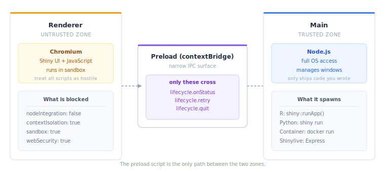

Electron runs untrusted content by default. You turn that off. An Electron app is Chromium plus full Node.js: it can read files, spawn processes, and hit the network with no restrictions. Security is split between what shinyelectron sets up for you and what your app code does. For production builds, also [sign your app](code-signing.html).

## Two processes, one trust boundary

An Electron app has two process types:

- **Main process.** Runs Node.js with full OS access. Creates windows, runs the app lifecycle, spawns R, Python, or a container.
- **Renderer process.** Displays web content: your Shiny app. It should be sandboxed and locked away from Node.js.

The rule: **the renderer never touches Node.js directly**. If `nodeIntegration` is on, any JavaScript in the renderer, including a script injected through an XSS bug, can run arbitrary OS commands. Treat the renderer as hostile territory and give it the narrowest possible gate to the main process.

{fig-alt="Diagram of the Electron trust boundary. On the left, the renderer process hosts Chromium with the Shiny UI, treated as an untrusted zone with nodeIntegration false, contextIsolation true, sandbox true, and webSecurity true. In the middle, a preload script using contextBridge exposes only a narrow IPC surface: lifecycle.onStatus, lifecycle.retry, and lifecycle.quit. On the right, the trusted main process runs Node.js with full OS access and spawns R via shiny runApp, Python via shiny run, container backends via docker run, or the Express server for Shinylive."}

For the full checklist, see the [Electron Security Checklist](https://www.electronjs.org/docs/latest/tutorial/security).

## What shinyelectron sets by default

The generated Electron configuration ships with secure defaults:

```js
// From the generated main.js BrowserWindow config
webPreferences: {
  nodeIntegration: false,
  contextIsolation: true,
  sandbox: true,
  enableRemoteModule: false,
  webSecurity: true,
  preload: path.join(__dirname, 'preload.js'),
  partition: 'persist:<app_slug>'
}
```

Each setting, in one line:

| Setting | Value | Purpose |
|---------|-------|---------|
| `nodeIntegration` | `false` | Renderer cannot use `require()` or Node APIs |
| `contextIsolation` | `true` | Preload runs in a separate context from page scripts |
| `sandbox` | `true` | Renderer sits inside the Chromium sandbox |
| `enableRemoteModule` | `false` | Kills the deprecated `remote` module |
| `webSecurity` | `true` | Same-origin policy stays on |
| `partition` | per-app | Session storage is isolated between shinyelectron apps |

**The preload script is the only bridge.** It exposes a narrow IPC surface (`lifecycle.onStatus`, `lifecycle.retry`, `lifecycle.quit`, and a few peers) through `contextBridge.exposeInMainWorld()`. The renderer can call those functions and nothing else. It never sees `ipcRenderer` and never imports a Node module.

**DevTools stay off.** The DevTools menu item appears only when `show_dev_tools` is enabled in the config. Leave it disabled for production.

## Content Security Policy

### Shinylive apps

Shinylive runs WebR or Pyodide in the browser. That needs `SharedArrayBuffer`, and `SharedArrayBuffer` needs cross-origin isolation. The shinylive backend sets these headers automatically:

```
Cross-Origin-Opener-Policy: same-origin
Cross-Origin-Embedder-Policy: require-corp
Cross-Origin-Resource-Policy: cross-origin
```

They unlock WebAssembly threading and are only set on responses from the local Express server.

### Native apps

Native R or Python apps load from `localhost`. The content originates from a process you control, so there is no extra CSP to configure.

**Rule of thumb.** Avoid external scripts (CDNs, third-party widgets) unless the app genuinely needs them. Each external resource adds a trust dependency you cannot audit. Bundle local copies when you can.

## What your app code can still do

shinyelectron secures the Electron shell. Your Shiny code runs with the same OS permissions as the user who launched the app.

### Shell access

Your Shiny app can execute system commands through:

- **R**: `system()`, `system2()`, `processx::run()`, `callr::r()`
- **Python**: `subprocess.run()`, `os.system()`, `os.popen()`

That is not a bug: it is what a desktop app can do. But it means:

- **Validate every input** that feeds a system call, file path, or database query. Shiny's reactive inputs come from the renderer, and a determined user can send crafted values.
- **Never build shell commands from user input by string concatenation.** Use parameterized APIs: `processx::run()` with a character vector, not `system(paste(...))`.
- **Least privilege.** If the app does not need to write files or spawn processes, do not include code that can.

### File system access

The app inherits the launching user's file permissions. `file.choose()`, `readLines()`, Python's `open()`: they can reach anything that user can reach. Expected for a desktop app. Worth remembering if you are porting a Shiny app that previously ran in a sandboxed server.

## Distribution security

### Code signing

Unsigned apps trigger OS warnings: Gatekeeper on macOS, SmartScreen on Windows. macOS tags downloads with a quarantine attribute that Gatekeeper reads before letting the app run. Sign your production builds. See the [Auto-Updates vignette](auto-updates.html#code-signing) and [GitHub Actions vignette](github-actions.html#code-signing) for platform setup.

### Auto-updates

Serve update manifests and binaries over HTTPS. Always. `electron-updater` verifies signatures, but plain HTTP opens the door to man-in-the-middle swaps of the manifest itself.

### Secrets

Do not bundle secrets:

```
# These should NEVER be in your app directory
.env
.Renviron
credentials.json
service-account-key.json
```

**Add them to `.gitignore`**. Make sure your build process does not copy them into the Electron bundle. If your app needs API keys at runtime:

- Environment variables the user sets on their machine.
- An OS keychain via [keyring](https://cran.r-project.org/package=keyring).
- Prompt on first launch, then store encrypted credentials in the app's user data directory.

## Container strategy security

The container strategy (`runtime_strategy: "container"`) runs your Shiny app inside Docker or Podman. That buys real isolation:

- The app cannot see the host filesystem unless you explicitly mount volumes via `container.volumes` in `_shinyelectron.yml`.
- Network reaches only the published port.
- The container runs as a non-root user in shinyelectron's default images.

Containers are isolation, not a security wall:

- Docker's daemon runs as root on Linux. Podman runs rootless by default.
- Mounted volumes give the container read/write access to those host paths. Mount only what you must.
- Container escapes are rare but real. Keep Docker or Podman patched.

## What NOT to do

These are the common Electron footguns. shinyelectron's defaults block all of them. You can re-enable them by editing the generated files. Do not.

::: {.callout-warning}
### Do not modify these settings in the generated Electron code

- **Do not set `nodeIntegration: true`** in `webPreferences`. Any script in the renderer, including anything injected by XSS, gets full Node.js access.

- **Do not set `webSecurity: false`**. Same-origin policy is what keeps random pages from calling arbitrary origins.

- **Do not set `contextIsolation: false`**. Page scripts can then reach into the preload scope. The security boundary is gone.

- **Do not load remote URLs in the main window.** shinyelectron loads `localhost` (native backends) or local files (lifecycle pages). Loading an external URL runs untrusted code with your app's Electron privileges.

- **Do not ship debug builds.** Turn off `show_dev_tools` in production. DevTools lets anyone, or anything, inspect the app, run JavaScript, and reach the Node.js console in the main process.
:::

## Summary

| Layer | Who is responsible | What to do |
|-------|-------------------|------------|
| Electron shell | shinyelectron | Secure defaults are set automatically |
| Shiny app code | You | Validate inputs, avoid unsafe system calls |
| Credentials | You | Never bundle secrets; use env vars or keychain |
| Code signing | You | Sign builds for production distribution |
| Container isolation | shinyelectron + You | Default images are sandboxed; be careful with volumes |

Further reading: the [Electron Security documentation](https://www.electronjs.org/docs/latest/tutorial/security).
